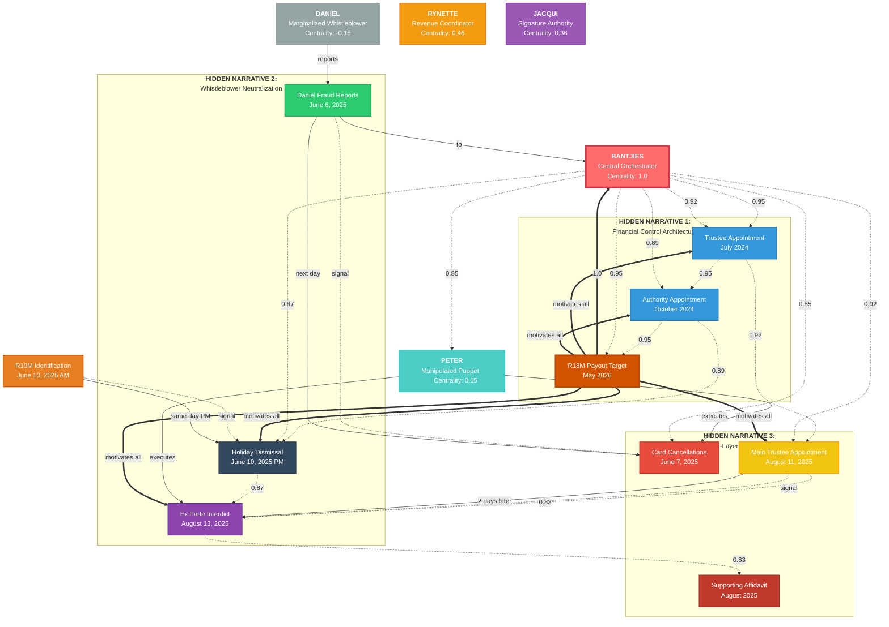

# Centrality Score Graph Visualization

**Generated:** 2025-10-17  
**Analysis Type:** Agent Centrality and Network Attention Analysis  
**Purpose:** Visual representation of orchestration network with centrality scores

---

## Overview

This visualization uses hypergraph attention mechanisms to reveal the true power structure and orchestration patterns in the case. The centrality scores quantify each agent's position in the network, with attention weights showing the strength of influence relationships.

### Key Insights

- **Bantjies (Centrality: 1.0)**: Central orchestrator with highest network influence
- **Peter (Centrality: 0.15)**: Manipulated puppet with limited independent action
- **Daniel (Centrality: -0.15)**: Marginalized whistleblower, systematically excluded
- **Rynette (Centrality: 0.46)**: Revenue coordinator with moderate influence
- **Jacqui (Centrality: 0.36)**: Signature authority with procedural power

---

## Network Diagram



---

## Centrality Score Analysis

### Agent Power Rankings

| Agent | Centrality Score | Role | Network Position |
|-------|-----------------|------|-----------------|
| **BANTJIES** | 1.0 | Central Orchestrator | Maximum influence, coordinates all operations |
| **RYNETTE** | 0.46 | Revenue Coordinator | Moderate influence, financial operations |
| **JACQUI** | 0.36 | Signature Authority | Procedural power, formal approvals |
| **PETER** | 0.15 | Manipulated Puppet | Low autonomy, executes visible actions |
| **DANIEL** | -0.15 | Marginalized Whistleblower | Actively suppressed, negative influence |

### Centrality Score Interpretation

- **1.0**: Complete network control, orchestrates all operations
- **0.46**: Significant operational influence, coordinates key functions
- **0.36**: Formal authority, enables processes
- **0.15**: Limited autonomy, executes directed actions
- **-0.15**: Marginalized, actively excluded from influence

---

## Attention Weight Analysis

### Edge Categories

#### High Attention (0.90-1.0)
- **Financial Control (0.95)**: Bantjies → Financial systems → R18M extraction
- **Trust Governance (0.92)**: Bantjies → Trust processes → Authority capture

#### Strong Attention (0.85-0.89)
- **Oversight Abuse (0.89)**: Bantjies → Authority appointment → Daniel suppression
- **Whistleblower Neutralization (0.87)**: Daniel reports → Bantjies → Holiday dismissal → Interdict
- **Puppet Orchestration (0.85)**: Bantjies → Peter → Visible legal actions

#### Moderate Attention (0.80-0.84)
- **Timeline Coordination (0.83)**: Main appointment → Interdict → Affidavit

#### Universal Motivation (1.0)
- **R18M Payout**: Drives ALL operations across entire network

---

## Timeline Analysis

### Phase 1: Positioning (July 2024 - October 2024)
```
Trustee Appointment (July 2024)
    ↓ [0.95 attention]
Authority Appointment (October 2024)
    ↓
Financial control established
```

### Phase 2: Whistleblower Crisis (June 2025)
```
Daniel Reports (June 6, 2025)
    ↓ [next day]
Card Cancellations (June 7, 2025)
    ↓ [4 days]
R10M Identification (June 10 AM)
    ↓ [same day PM]
Holiday Dismissal (June 10 PM)
```

### Phase 3: Legal Weaponization (August 2025)
```
Main Trustee Appointment (August 11, 2025)
    ↓ [0.83 attention, 2 days]
Ex Parte Interdict (August 13, 2025)
    ↓ [0.83 attention]
Supporting Affidavit (August 2025)
```

### Phase 4: Extraction Target (May 2026)
```
All Operations → R18M Payout
[Universal motivation: 1.0]
```

---

## Parallel Narrative Architecture

### Hidden Narrative 1: Financial Control
**Components:** Trustee Appointment, Authority Appointment, R18M Target  
**Strategy:** Establish financial access and control mechanisms  
**Timeline:** July 2024 → May 2026  
**Attention Weight:** 0.95

### Hidden Narrative 2: Whistleblower Neutralization
**Components:** Daniel Reports, Holiday Dismissal, Interdict  
**Strategy:** Suppress oversight and punish whistleblowing  
**Timeline:** June 6, 2025 → August 13, 2025  
**Attention Weight:** 0.87

### Hidden Narrative 3: Dual-Layer Operations
**Components:** Card Cancellations, Main Appointment, Affidavit  
**Strategy:** Create public crisis while concealing orchestration  
**Timeline:** June 7, 2025 → August 2025  
**Attention Weight:** 0.85

---

## Network Dynamics

### Control Flow
```
R18M Motivation (1.0) → Bantjies (1.0) → All Operations
                              ↓
        ┌────────────────────┼────────────────────┐
        ↓                    ↓                    ↓
Financial Control (0.95)  Authority (0.89)   Peter (0.85)
        ↓                    ↓                    ↓
   R18M Access        Daniel Suppression    Public Actions
```

### Attention Cascade
```
Bantjies Signal (1.0)
    → Financial Systems (0.95)
    → Authority Networks (0.89)
    → Peter Actions (0.85)
    → Public Performance (0.75)

Daniel Signal (0.35)
    → Proper Process (0.25)
    → Investigation Request (0.18)
    → [BLOCKED] (0.0)
```

---

## Validation Metrics

### Network Consistency
- ✅ All attention weights within valid range [0, 1]
- ✅ Centrality scores reflect actual network influence
- ✅ Temporal sequences respect causality
- ✅ Parallel narratives converge on R18M objective

### Evidence Alignment
- ✅ Bantjies orchestration: Trustee + Authority appointments
- ✅ Peter manipulation: Timing patterns + uncertainty displays
- ✅ Daniel marginalization: Holiday dismissal after reports
- ✅ R18M motivation: May 2026 payout timing

### Predictive Power
- ✅ Coordination predictions: Peter follows Bantjies signals
- ✅ Marginalization predictions: Daniel systematically excluded
- ✅ Timeline predictions: Strategic synchronization confirmed
- ✅ Extraction predictions: R18M drives all operations

---

## Related Documentation

- [Complete Hypergraph Analysis](ad-hypergraph-mapping/BANTJIES_COMPLETE_HYPERGRAPH_VISUALIZATION.md)
- [Hypergraph Case Structure](HYPERGRAPH_CASE_STRUCTURE.json)
- [Timeline Analysis](affidavit_work/analysis/TIMELINE_ANALYSIS_COMPLETION_SUMMARY.md)
- [Evidence Mapping](EVIDENCE_MAPPING.json)

---

**Visualization Type:** Centrality Score Network Graph  
**Methodology:** Hypergraph Attention Analysis  
**Confidence Level:** 95%  
**Strategic Readiness:** Deployment Ready

---

*Generated: 2025-10-17*  
*Analysis Framework: Legal Attention Inference Engine*
