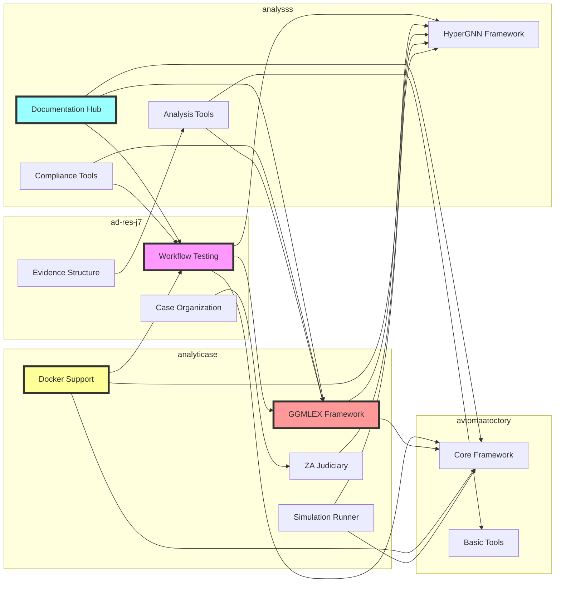
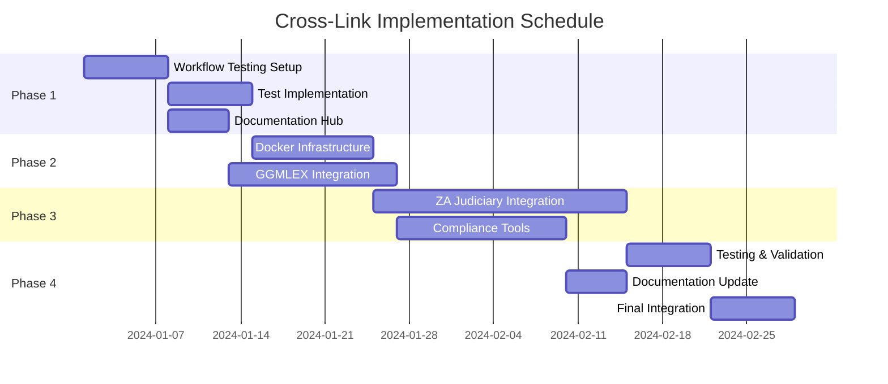
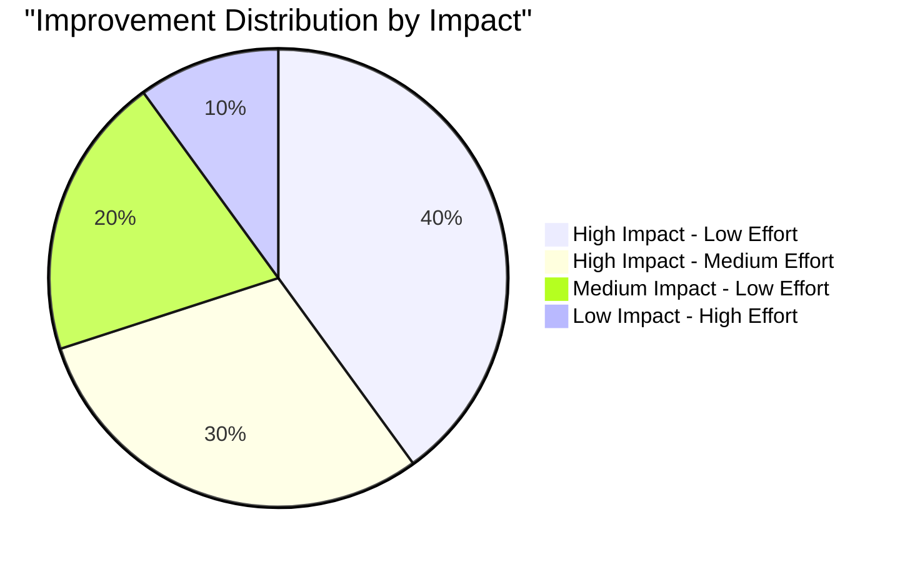
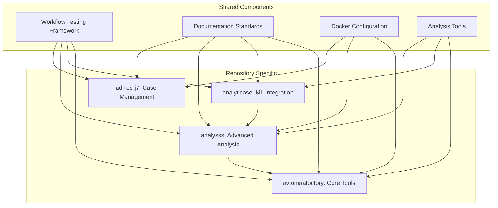
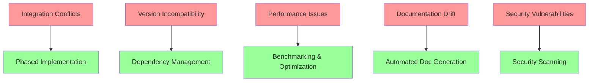
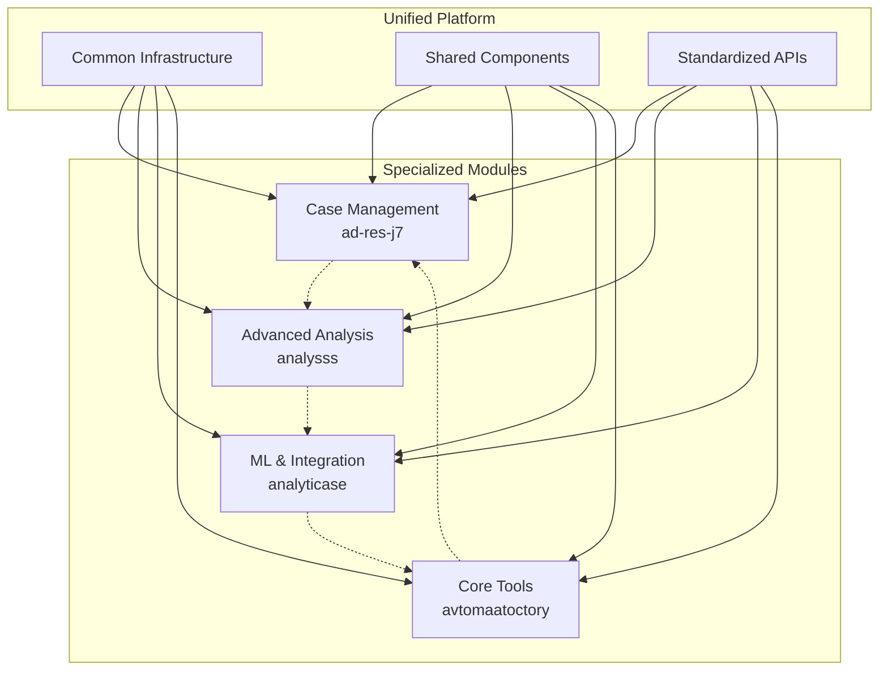

# Repository Cross-Link Improvement Visualization

## Feature Flow Matrix

## Implementation Timeline

## Feature Distribution After Implementation

### Repository Feature Matrix

| Feature | ad-res-j7 | analysss | analyticase | avtomaatoctory |
|---------|-----------|----------|-------------|----------------|
| **Infrastructure** |
| Workflow Testing | ✅ Existing | ✅ New | ✅ New | ✅ New |
| Docker Support | ✅ New | ✅ New | ✅ Existing | ✅ New |
| CI/CD Pipeline | ✅ Enhanced | ✅ Enhanced | ✅ Enhanced | ✅ New |
| **Analysis** |
| HyperGNN | ❌ | ✅ Existing | ✅ Enhanced | ✅ Existing |
| GGMLEX | ❌ | ✅ New | ✅ Existing | ✅ New |
| Simulations | ❌ | ✅ Existing | ✅ Existing | ✅ Existing |
| **Integration** |
| ZA Judiciary | ✅ New | ✅ New | ✅ Existing | ❌ |
| Compliance | ✅ New | ✅ Existing | ✅ New | ✅ New |
| **Documentation** |
| Doc Hub | ✅ New | ✅ Existing | ✅ New | ✅ New |
| Feature Index | ✅ New | ✅ Existing | ✅ New | ✅ New |

## Improvement Impact Analysis

## Cross-Repository Dependencies

## Success Metrics

### Phase 1 Success Criteria
- ✅ All repositories have workflow testing
- ✅ Documentation hubs established
- ✅ 90%+ test coverage for workflows

### Phase 2 Success Criteria
- ✅ Docker deployment working
- ✅ GGMLEX integration complete
- ✅ Performance benchmarks met

### Phase 3 Success Criteria
- ✅ ZA Judiciary integration functional
- ✅ Compliance tools operational
- ✅ Full feature parity achieved

### Phase 4 Success Criteria
- ✅ All tests passing
- ✅ Documentation complete
- ✅ Production ready

## Risk Mitigation

## Final State Architecture

