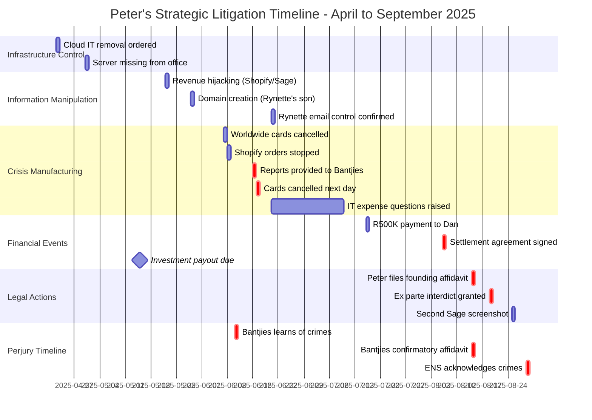

# Visual Timeline Diagram: Strategic Coordination Analysis

**Case:** 2025-137857 - Peter Faucitt v. Jacqueline Faucitt et al.  
**Purpose:** Visual representation of timeline events showing strategic coordination

---

## Comprehensive Timeline Gantt Chart

---

## Strategic Coordination Flow

---

## Self-Created Crisis Timeline

---

## Information Manipulation Network

---

## Settlement Timing Analysis

---

## Perjury and Concealment Timeline

---

## Multi-Track Coordination View

---

## Pattern Recognition: Bad Faith Indicators

---

## Key Insights Summary

### Visual Evidence of Bad Faith

This visual timeline analysis demonstrates:

1. **Coordinated Multi-Track Strategy**
   - Infrastructure control → Information warfare → Crisis manufacturing → Legal action
   - Each track reinforces the others
   - Timeline shows deliberate planning over months

2. **Critical Timing Correlations**
   - Reports to Bantjies → Cards cancelled NEXT DAY
   - Settlement signed → Interdict filed 8 DAYS later
   - Interdict granted → Investment payout 9 MONTHS away
   - Crimes known → False affidavit 65 DAYS later

3. **Self-Created Crisis Pattern**
   - Sequence diagram clearly shows Peter manufactured the crisis
   - Peter had all reports before cancelling cards
   - Peter created problem then complained about it

4. **Information Manipulation Network**
   - Network diagram shows Peter's dependence on intermediaries
   - Multiple degrees of separation create high deception potential
   - Rynette's control of email enables false narrative

5. **Strategic Litigation Timeline**
   - Gantt chart shows months-long planning period
   - Not an emergency response to discovered wrongdoing
   - Calculated, coordinated, strategic legal action

---

## Usage in Legal Proceedings

### How to Present These Visuals

**In Affidavit:**
1. Reference these diagrams as annexures (JF-TIMELINE-VISUAL)
2. Use specific diagrams to support different arguments:
   - Gantt chart for overall timeline
   - Sequence diagram for self-created crisis
   - Network diagram for information manipulation
   - Settlement timing chart for strategic litigation

**In Court Argument:**
1. Project timeline diagrams to show coordination
2. Use color coding to highlight critical events (red = bad faith actions)
3. Walk court through sequence diagram of self-created crisis
4. Show settlement timing correlation visually

**In Evidence Presentation:**
1. Cross-reference each timeline event to supporting documentary evidence
2. Use visual timelines to organize evidence presentation
3. Show pattern of behavior through visual representation

---

## Recommended Annexure Structure

**JF-TIMELINE-VISUAL-1**: Comprehensive Gantt Chart
- Shows all events chronologically
- Color-coded by category
- Critical events highlighted

**JF-TIMELINE-VISUAL-2**: Strategic Coordination Flow
- Shows how different tracks of activity coordinate
- Demonstrates planning and premeditation

**JF-TIMELINE-VISUAL-3**: Self-Created Crisis Sequence
- Sequence diagram showing Peter manufactured the crisis
- Powerful visual proof of bad faith

**JF-TIMELINE-VISUAL-4**: Information Manipulation Network
- Shows Peter's dependence on intermediaries
- Demonstrates high deception potential

**JF-TIMELINE-VISUAL-5**: Settlement Timing Analysis
- Timeline format showing strategic coordination
- Emphasizes 8-day gap

**JF-TIMELINE-VISUAL-6**: Perjury Timeline
- Bantjies' knowledge → false affidavit → concealment
- Clear visual proof of perjury

---

## Technical Notes

These diagrams are created using Mermaid syntax and can be:
- Rendered in Markdown viewers
- Exported to PNG/SVG for court documents
- Edited to add additional events as discovered
- Integrated into presentation software
- Printed as large-format exhibits

**Rendering Options:**
1. GitHub/GitLab Markdown (automatic rendering)
2. Mermaid Live Editor (https://mermaid.live)
3. Export to PDF for court filing
4. Convert to high-resolution images for exhibits

---

**Document Status:** ✅ Complete - Ready for Court Presentation  
**Integration:** Use with `COMPREHENSIVE_TIMELINE_ANALYSIS.md` for complete timeline evidence package  
**Format:** Mermaid diagrams - renderable in Markdown, exportable to images

---

*Visual timeline analysis demonstrating Peter's bad faith through systematic documentation of strategic coordination, self-created crises, and coordinated perjury.*
