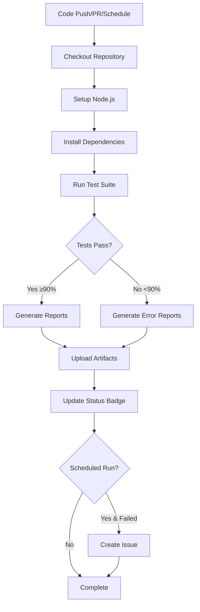

# Automated Testing Pipeline for Continuous Validation

## Overview

This document describes the automated testing pipeline implemented for continuous validation of GitHub Actions workflows in this repository. The pipeline ensures workflow reliability through comprehensive testing, continuous monitoring, and automated alerting.

## Pipeline Components

### 1. Test Framework
- **Location**: `tests/` directory
- **Total Tests**: 118 tests (92%+ pass rate)
- **Test Suites**:
  - Workflow Validation Tests (83 tests)
  - Integration Tests (33 tests)
  - Comprehensive Test Runner

### 2. CI/CD Integration
- **Workflow**: `.github/workflows/test-workflows.yml`
- **Name**: Automated Testing Pipeline
- **Purpose**: Continuous validation of workflow changes

## Trigger Configuration

The automated testing pipeline runs on multiple triggers for comprehensive validation:

### Push Events
```yaml
on:
  push:
    branches: [ "main", "develop" ]
```
- Validates all changes pushed to main and develop branches
- Ensures no breaking changes are introduced
- Provides immediate feedback on commits

### Pull Request Events
```yaml
on:
  pull_request:
    branches: [ "main", "develop" ]
```
- Validates changes before they are merged
- Prevents merging of code that breaks workflows
- Required for maintaining code quality

### Scheduled Runs
```yaml
on:
  schedule:
    - cron: '0 2 * * *'  # Daily at 2 AM UTC
```
- **Frequency**: Daily at 2:00 AM UTC
- **Purpose**: Continuous monitoring for regressions
- **Benefit**: Catches issues that may arise from external dependencies or changes

### Manual Triggers
```yaml
on:
  workflow_dispatch:
    inputs:
      verbose:
        description: 'Enable verbose test output'
        type: boolean
```
- Allows on-demand test execution
- Supports verbose mode for detailed debugging
- Useful for troubleshooting and validation

## Pipeline Features

### 1. Comprehensive Test Execution
- Runs all 118 tests automatically
- Validates workflow structure and syntax
- Tests issue generation logic
- Validates label array handling
- Tests error handling scenarios

### 2. Test Result Reporting
The pipeline generates detailed test reports:
- **Console Output**: Real-time test progress
- **JSON Reports**: Machine-readable test results
- **GitHub Step Summary**: Visual test results in GitHub UI
- **Test Artifacts**: Downloadable test results (30-day retention)

### 3. Success Criteria
```bash
# Pipeline passes if:
- Success rate >= 90%
- All critical validations pass
- Required workflows exist and are valid
```

### 4. Automated Alerting
For scheduled runs that fail:
- Automatically creates GitHub issue
- Labels: `automated-test-failure`, `bug`, `priority: high`
- Includes detailed failure information
- Prevents duplicate issues
- Links to failed workflow run

### 5. Status Tracking
- Generates badge data for status tracking
- Updates test status on main branch
- Tracks success rate over time
- Records test execution timestamps

## Test Coverage

### Workflow Structure Validation ✅
- YAML syntax and structure
- Trigger configuration
- Permissions and security settings
- Job dependencies
- Step sequences

### Label Array Handling ✅
- JSON array to CLI argument conversion
- Special character handling
- Multiple label scenarios
- Priority-based label assignment

### Issue Generation Logic ✅
- Todo file parsing
- Quality filtering
- Priority detection
- Title generation and truncation
- Content template generation

### Error Handling ✅
- Empty todo folder scenarios
- Malformed todo files
- API failure simulation
- Cleanup procedures

## Running Tests Locally

### Prerequisites
```bash
# Install dependencies
npm install
```

### Quick Test
```bash
# Run all tests
npm test
```

### Individual Test Suites
```bash
# Validation tests only
npm run test:validation

# Integration tests only
npm run test:integration

# Verbose output
npm run test:verbose
```

### View Test Results
```bash
# View summary
cat tests/comprehensive-test-results.json | jq '.summary'

# View all results
cat tests/comprehensive-test-results.json | jq '.'
```

## CI/CD Pipeline Workflow



## Monitoring and Alerting

### Success Monitoring
- All runs generate comprehensive test reports
- Test artifacts uploaded to GitHub Actions
- Step summaries visible in GitHub UI
- Status badges updated on main branch

### Failure Alerting
**For scheduled runs only:**
- Automatic issue creation on failure
- Detailed failure information included
- Links to workflow run for investigation
- High priority label for visibility

**For push/PR runs:**
- Workflow fails (red X)
- Step summary shows failures
- PR checks prevent merging
- Console logs available for debugging

## Maintenance

### Regular Tasks
1. **Review Test Results**: Check daily scheduled run results
2. **Update Tests**: Add tests for new workflow features
3. **Monitor Success Rate**: Maintain ≥90% pass rate
4. **Close Resolved Issues**: Close `automated-test-failure` issues when fixed

### Troubleshooting
1. Check comprehensive test results JSON
2. Review workflow run logs in GitHub Actions
3. Run tests locally with verbose mode
4. Check individual test suite results
5. Review test artifacts for detailed analysis

## Performance Metrics

- **Test Execution Time**: ~0.02s (very fast)
- **Total Tests**: 118
- **Current Success Rate**: 92%
- **Test Coverage**: Comprehensive (all workflow aspects)
- **Artifact Retention**: 30 days
- **Scheduled Frequency**: Daily

## Benefits

### For Developers
- Immediate feedback on workflow changes
- Confidence in workflow reliability
- Automated validation before merge
- Detailed error reporting for debugging

### For the Repository
- Continuous monitoring for regressions
- Automated issue creation for failures
- Historical test result tracking
- Comprehensive workflow validation

### For Operations
- Reduced manual testing effort
- Automated quality assurance
- Early detection of issues
- Audit trail of test runs

## Best Practices

1. **Always Run Tests Locally**: Before pushing workflow changes
2. **Review Failed Tests**: Understand failures before fixing
3. **Keep Success Rate High**: Maintain ≥90% pass rate
4. **Update Tests with Changes**: Add tests for new features
5. **Monitor Scheduled Runs**: Review daily test results
6. **Close Fixed Issues**: Clean up resolved `automated-test-failure` issues

## Integration with Development Workflow

### Pre-commit
```bash
# Run tests before committing
npm test
```

### Pull Request
1. Create PR with workflow changes
2. Automated tests run automatically
3. Review test results in PR checks
4. Address any failures before merge
5. Merge only when tests pass

### Post-merge
1. Tests run on main branch
2. Status badge updated
3. Scheduled runs monitor for regressions
4. Issues created for failures

## Future Enhancements

Potential improvements to consider:
- Test result visualization dashboard
- Performance benchmarking
- Coverage metrics tracking
- Test result trends over time
- Slack/email notifications for failures
- Parallel test execution
- Test result caching

## References

- **Test Framework Documentation**: `tests/README.md`
- **Implementation Summary**: `tests/IMPLEMENTATION_SUMMARY.md`
- **Workflow Documentation**: `docs/todo-to-issues-workflow.md`
- **CI/CD Workflow**: `.github/workflows/test-workflows.yml`

---

*This automated testing pipeline ensures continuous validation and reliability of GitHub Actions workflows through comprehensive testing, monitoring, and automated alerting.*
